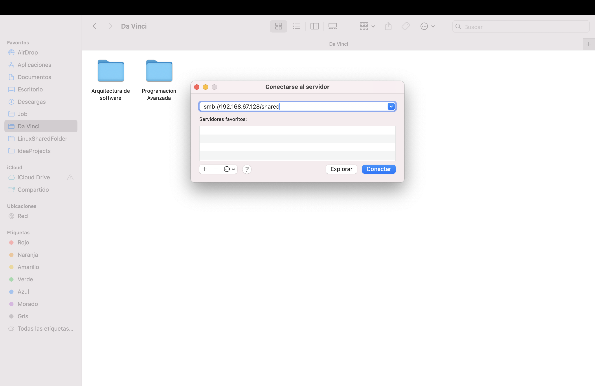

# Guía Completa para Crear un Servidor de Archivos Samba en Linux

Esta guía te mostrará paso a paso cómo instalar y configurar un servidor Samba en un sistema Linux (como Ubuntu o Debian) para compartir carpetas en una red. Cubriremos una configuración básica y luego una configuración más avanzada con permisos por grupos de usuarios.

## Parte 1: Instalación y Configuración Básica

En esta primera parte, crearemos una carpeta compartida de acceso público.

### Paso 1: Instalar Samba

Primero, debemos asegurarnos de que Samba esté instalado en nuestro servidor. Abre una terminal y ejecuta el siguiente comando para instalar el paquete de Samba.

```bash
sudo apt update && sudo apt install samba -y
```


### Paso 2: Crear la Carpeta a Compartir

Ahora, crearemos el directorio que queremos compartir en la red. Para este ejemplo, la llamaremos `compartido`.

```bash
sudo mkdir /home/sharedfolder
```


### Paso 3: Asignar Permisos a la Carpeta

Para que cualquier usuario pueda acceder y escribir en la carpeta sin problemas en esta configuración inicial, le daremos permisos abiertos.

**Nota:** Esto es solo para la prueba inicial. Más adelante ajustaremos los permisos para mayor seguridad.

```bash
sudo chmod 777 /home/sharedfolder
```


### Paso 4: Configurar el Recurso Compartido

Debemos editar el archivo de configuración de Samba, llamado `smb.conf`, para definir nuestra nueva carpeta compartida.

```bash
sudo nano /etc/samba/smb.conf
```


Ve hasta el final del archivo y añade las siguientes líneas:

```ini
[CompartidoPublico]
path = /home/sharedfolder
browseable = yes
writable = yes
guest ok = yes
read only = no
```

### Paso 5: Reiniciar el Servicio de Samba

Para que los cambios en la configuración surtan efecto, debemos reiniciar el servicio de Samba.

```bash
sudo systemctl restart smbd
```


## Parte 2: Conectarse desde un Cliente (macOS)

### Paso 6: Obtener el Nombre o IP del Servidor

Para conectarte, necesitas saber el nombre de host (hostname) o la dirección IP de tu servidor Linux. Puedes obtener el nombre de host con este comando:

```bash
hostname
```


### Paso 7: Conexión desde macOS

En tu Mac, abre el **Finder** y ve al menú **Ir > Conectarse al servidor...** (o presiona `Cmd + K`). En la ventana que aparece, escribe `smb://` seguido del nombre de host o la IP de tu servidor.

`smb://nombre-del-servidor`




¡Felicidades! Ahora deberías ver la carpeta compartida y poder acceder a ella desde tu Mac y tu máquina Linux simultáneamente.


## Parte 3: Configuración Avanzada con Permisos de Grupo

Ahora, haremos la configuración más segura, restringiendo el acceso solo a usuarios que pertenezcan a un grupo específico.

### Paso 9: Crear un Grupo y Asignar Propiedad

Primero, creamos un grupo de usuarios que tendrá acceso a la carpeta. Lo llamaremos `sambausers`.

```bash
sudo groupadd sambausers
```

A continuación, cambiamos el propietario de la carpeta compartida al usuario `root` y al grupo `sambausers`.

```bash
sudo chown root:sambausers /home/sharedfolder
```


Ahora, ajustamos los permisos para que solo el propietario y los miembros del grupo puedan escribir en la carpeta.

```bash
sudo chmod 775 /home/sharedfolder
```


### Paso 10: Modificar la Configuración de Samba para Usar Grupos

Abre de nuevo el archivo de configuración de Samba.

```bash
sudo nano /etc/samba/smb.conf
```

Modifica la sección que creaste antes para que se vea así. Eliminamos el acceso de invitado (`guest ok`) y especificamos qué grupo tiene permisos de escritura.

```ini
[CompartidoSeguro]
path = /home/sharedfolder
browseable = yes
read only = no
valid users = @sambausers
write list = @sambausers
force group = sambausers
create mask = 0664
directory mask = 0775
```


### Paso 11: Añadir Usuarios al Grupo y a Samba

Supongamos que tienes un usuario en Linux llamado `testuser`. Primero, lo añadimos al grupo `sambausers`.

```bash
sudo usermod -aG sambausers testuser
```


Un usuario de Linux no es automáticamente un usuario de Samba. Debes crearle una contraseña específica para Samba.

```bash
sudo smbpasswd -a testuser
```

Te pedirá que introduzcas y confirmes una nueva contraseña para ese usuario.

### Paso 12: Reiniciar y Probar

Reinicia el servicio de Samba una vez más para aplicar la nueva configuración segura.

```bash
sudo systemctl restart smbd
```

Ahora, cuando intentes conectarte desde tu Mac u otro cliente, el sistema te pedirá un nombre de usuario y una contraseña. Usa las credenciales que acabas de configurar con `smbpasswd`.

